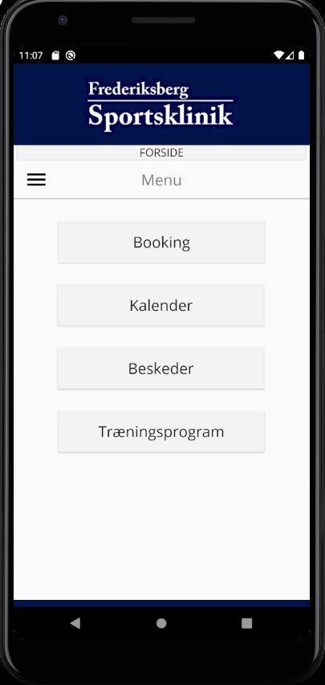
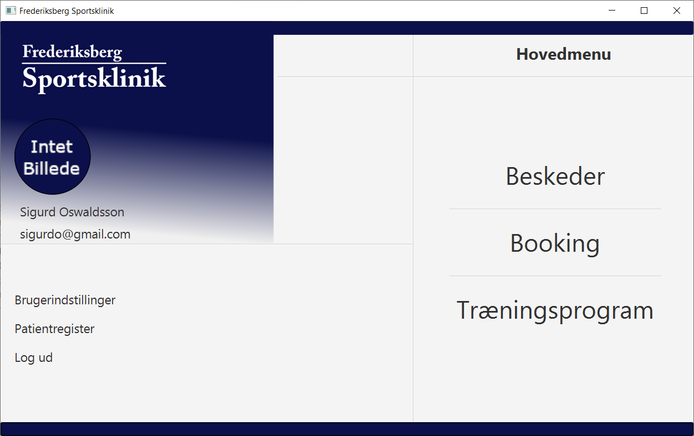

# Foersteaarsprojekt
Dette er en app som vi har udviklet i forhold til vores førsteårsprojekt i datamatiker linjen. Apperne vi har udviklet er til 
Frederiksbergs Sportsklinik, som har anmodet om en android app til patienterne og en desktop app til behandlerne. Desktop appen
gør det muligt for behandlerne at tildele træningsprogrammer, book og se bookede tider og sende beskeder til deres patienter. 
I Android appen kan patienterne kontakte deres behandler via beskeder, book tider samt tjekke kalenderen for deres bookede tider
og se træningsprogrammer som er sent fra behandleren. 

Dette er et eksempel på Android appen, hvor patienten har logget ind og er inde på siden hvor de så kan vælge hvad de skal gøre.

Her er et eksempel på vores desktop app, hvor behandleren har logget ind og de kan så vælge om de vil sende beskeder til patienterne
eller andre tilgængelige handlinger. Begge apps er designet til at kommunikere med hinanden ved brug af Cloud Firestore i Firebase,
som er en online database som gemmer ændringerne i vores program. Lige nu er det kun Android appen som kan installeres. 
Installations filen findes i releases som en APK fil sammen med source coden.
